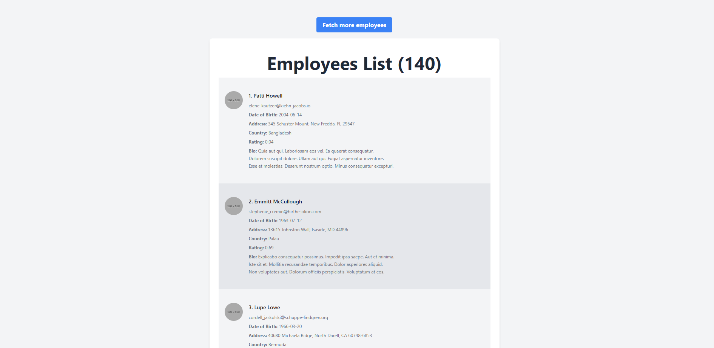

# README

## PROJECT DESCRIPTION
https://www.loom.com/share/ab8d71ea6c0d4ae88751f8a684e70894

## CHALLENGE RELATED FILES
1. [Routes](config/routes.rb)
2. [Employees Controller](app/controllers/employees_controller.rb)
3. [API Adapter](app/adapters/api_adapter.rb)
4. [Employees Service](app/services/employee_service.rb)
5. [Employee Model](app/models/employee.rb)
6. [Tailwind View](app/views/employees/index.html.erb)
7. [ENVs Configuration](config/initializers/api_config.rb)
8. [Credentials storage](env) sholud be ignored in production deployment
9. [Dockerfile](Dockerfile)
10. [Docker compose](docker-compose.yml)
11. [Dockerfile for prod build](Dockerfile.prod)

## INSTALLATION

### Development
1. Install docker & docker-compose
2. docker-compose up
3. Go to http://localhost

### Production
1. docker build -f Dockerfile.prod -t javifloresi/rails-challenge .
2. docker run --env-file env -d -p 80:80 javifloresi/rails-challenge
3. Go to http://localhost

